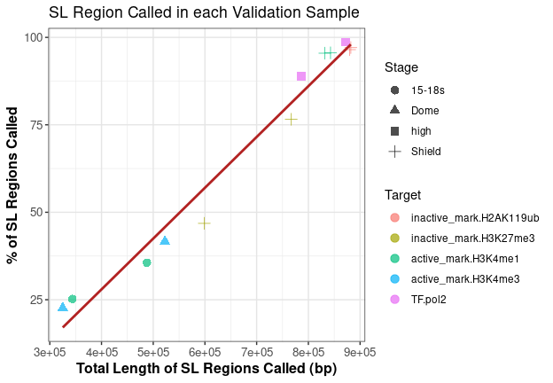

# SuspectPeakHunter_Plots
Aisha Shah (Vastenhouw Lab)

\#============================================= \# 1. Load Required
Libraries \#=============================================

``` r
# Data manipulation
library(dplyr)
library(tidyr)
library(reshape2)  # For melt function

# Google Sheets integration
library(googlesheets4)

# Visualization
library(ggplot2)
library(patchwork)  # Plot arrangement
library(ggh4x)      # Advanced ggplot extensions
library(ggbio)      # Genomics visualization
library(pheatmap)   # Heatmaps

# Differential binding analysis
library(DiffBind)
```

\#============================================= \# 2. Plot 1: Dataset
Overview \#=============================================

``` r
# ------------------------
# 2.1 Prepare Metadata
# ------------------------
# Read metadata from Google Sheets
metadata <- read_sheet(
  'https://docs.google.com/spreadsheets/d/1ILO-Fz-FNIOFgycFw1VkThAOn6MiX0oSqNBABf9WexY/edit#gid=1554291637',
  sheet = "CnR.SraRunInfo"
)

# Define developmental stage order and colors
stage_order <- c("Dome", "Shield", "15-18s", "6hpf", "24hpf", "high")
stage_colors <- c(
  Dome    = "#59b59a",
  Shield  = "#df8948",
  "15-18s"= "#9895c4",
  "6hpf"  = "#e863a7",
  "24hpf" = "#8ebb5c",
  high    = "#e8be48"
)

# Convert to factor for proper ordering
metadata <- metadata %>%
  mutate(cell_stage = factor(cell_stage, levels = stage_order))

# ------------------------
# 2.2 Create Subplots
# ------------------------
# Plot 1A: Summary of number of samples from different studies
plot_1a <- metadata %>%
    distinct(Sample_Labels.short, .keep_all = TRUE) %>%
    mutate(experiment_group=ifelse(experiment_group=="pos_ctrl_target_enriched","pos_ctrl",experiment_group)) %>%
    ggplot( aes(x = BioProject ,fill = experiment_group)) +
    geom_bar() + 
    scale_fill_manual(values =c("target_enriched"="#59838c","pos_ctrl"=alpha( "#59838c",0.6),"neg_ctrl"="grey"))+
    geom_text(stat = "count", aes(label = ..count..), position = position_stack(vjust = 0.5), size = 3, color = "white") +
    theme_bw()  +
    theme(
        plot.background = element_rect(fill = 'transparent', color = NA),
        axis.text.x = element_text(size = 11,angle=90,vjust = 0.5, hjust=1),
        axis.text.y=element_blank(), 
        axis.title.y = element_blank(), 
        axis.ticks.y = element_blank(),
        axis.title.x = element_text(size=13),
        ### For the legend
        legend.position = "inside",
        legend.position.inside = c(0.3,0.77), 
        legend.background = element_rect(fill = "transparent"), 
        legend.title = element_text( size=8), 
        legend.text=element_text(size=8), 
        legend.key.size = unit(x = 0.3,units = "cm"),
        panel.grid = element_blank()) + 
  
    labs(x="BioProject ID") +
    facet_grid(~paste0("CUT&RUN Datasets\nTotal = ",metadata %>% distinct(Sample_Labels.short) %>% nrow()))


# Plot 1B: Target distribution
plot_1b <- metadata %>%
  filter(experiment_group == "target_enriched") %>%
  distinct(Sample_Labels.short, .keep_all = TRUE) %>%
  ggplot(aes(x = Target, fill = cell_stage)) +
  geom_bar() +
  geom_text(stat = "count", aes(label = ..count..), 
          position = position_stack(vjust = 0.5), size = 3, color = "black") +
  scale_fill_manual(values = stage_colors, name = "Developmental\nStage") +
  facet_grid(~Target_Class, space = "free", scales = "free") +
  #labs(title = "Target Distribution Across Developmental Stages") +
  theme_bw() +
  theme(
    axis.text.x = element_text(angle = 90, hjust = 0.95, vjust = 0.5),
    panel.grid = element_blank()
  )

# ------------------------
# 2.3 Combine Plots
# ------------------------
combined_plot <- wrap_plots(
  plot_1a,
  plot_spacer(),  # Add empty space between plots
  plot_1b,
  ncol = 3,
  widths = c(0.26, 0.001, 0.739)
) +
  plot_annotation(tag_levels = list(c("A", "B")))

# Save plot
# ggsave("results/figures/dataset_overview.png", combined_plot, 
#        width = 11, height = 4.5, dpi = 300)

combined_plot
```


\#=============================================  
\# 3. Plot 2: Differential Binding Heatmaps
\#=============================================

``` r
# Define paths
workdir <- "/home/saisha/Desktop/unil_work/Aisha-Dora/snakemake/SuspectPeak_Hunter/"
## metadata file paths
input_metadata<-paste0(workdir,"diffbind_array.validation_samples.tsv")  
input_metadata_noSL<-paste0(workdir, "diffbind_array.noSL.validation_samples.tsv")
# Output paths
outdir <- "plots/"
output_pdf <-  paste0(outdir, "heatmap.SL.pdf")        
output_pdf_noSL <-  paste0(outdir, "heatmap.noSL.pdf") 
# Create output directory if needed
if(!dir.exists(outdir)) {dir.create(outdir, recursive = TRUE)}
# Read metadata 
metadata <- read.csv(input_metadata, sep = "\t")
metadata_noSL <- read.csv(input_metadata_noSL, sep = "\t")

# ------------------------
# 3.1 With Suspect Regions
# ------------------------
DBA <- dba(sampleSheet=metadata)
#pdf(output_pdf)
dba.plotHeatmap(DBA, ColAttributes=c(DBA_FACTOR, DBA_REPLICATE, DBA_CONDITION))
```


``` r
#dev.off()

# --------------------------
# 3.2 Without Suspect Regions
# --------------------------
DBA_noSL <- dba(sampleSheet=metadata_noSL)
#pdf(output_pdf_noSL)
dba.plotHeatmap(DBA_noSL, ColAttributes=c(DBA_FACTOR, DBA_REPLICATE, DBA_CONDITION))
```


``` r
#dev.off()
```

\#=============================================  
\# 4. Plot 3: Suspect Region Validation
\#=============================================

``` r
# ------------------------
# 4.1 Load Data
# ------------------------
workdir <- "/home/saisha/Desktop/unil_work/Aisha-Dora/snakemake/SuspectPeak_Hunter/"

overlap.VL.SL <- read.table(paste0(workdir,"results/05.bootstrapping/06.Generating_SuspectLists.DS_10000000/filtered_mindepth_5.SEACR_0.1.SuspectList.prcnt_80/Overlap.Validation_Samples.SL.bed"),                              
                              col.names = c("SL.chr", "SL.start", "SL.end", "N_Bootstrap_Rounds",
                                "Name_Bootstrap_Rounds", "V.chr", "V.start", "V.end",
                                "V.total_signal", "V.max_signal", "V.max_signal_region",
                                "V.Sample_Name", "length.Overlap.SL.V"))

metadata <- read.csv(paste0(workdir,"validation_samples.tsv"), sep = "\t")
# ------------------------
# 4.2 Process Data
# ------------------------

overlap.VL.SL.filt <- overlap.VL.SL %>% filter(N_Bootstrap_Rounds>=5)
# Calculate total unique SL regions in the dataset
total_SL_regions <- overlap.VL.SL.filt %>%
  distinct(SL.chr, SL.start, SL.end) %>% 
  nrow()

# Create summary statistics per sample
validation_stats <- overlap.VL.SL.filt %>%
  group_by(V.Sample_Name) %>%
  summarise(
    total_length = sum(length.Overlap.SL.V),
    count_SL = n_distinct(paste(SL.chr, SL.start, SL.end))
  ) %>%
  mutate(
    percent_SL = (count_SL / total_SL_regions) * 100
  )


validation_stats <- validation_stats %>% 
  mutate(sample=gsub(".stringent.bed","",V.Sample_Name)) %>% 
  left_join(metadata %>% 
              select(sample = sample, Targets = Target, Stage = Stage, experiment_group = ctrl, Target_Group), 
            by = "sample") 

# ------------------------
# 4.3 Create Plot
# ------------------------
validation_stats %>% ggplot( aes(x = total_length, y = percent_SL, color=interaction(Target_Group,Targets))) +
    geom_point(size = 3, alpha = 0.7,aes(shape=Stage)) +
    geom_smooth(method = "lm", se = FALSE, color = "firebrick") +
    labs(
        x = "Total Length of SL Regions Called (bp)",
        y = "% of SL Regions Called",
        title = "SL Region Called in each Validation Sample"
    ) +
    theme_bw() +
    theme(
        panel.grid.major = element_line(color = "gray90"),
        axis.text = element_text(size = 10),
        axis.title = element_text(size = 12, face = "bold")
    ) +
    guides(color=guide_legend(title="Target"))
```



\#=============================================  
\# 5. Plot 4: Configuration Comparison
\#=============================================

``` r
# ------------------------
# 5.1 Define Processing Function
# ------------------------
process_config <- function(path, config_id) {
  df <- read.table(path)
  
  colnames(df) <- c("SL.chr", "SL.start", "SL.end", "N_Bootstrap_Rounds", "Name_Bootstrap_Rounds",
                    "V.chr", "V.start", "V.end", "V.total_signal", "V.max_signal", 
                    "V.max_signal_region", "V.Sample_Name", "length.Overlap.SL.V")
  
  total_SL <- df %>%
    distinct(SL.chr, SL.start, SL.end) %>%
    nrow()
  
  df_filt <- df %>% filter(N_Bootstrap_Rounds >= 5)
  
  df_filt %>%
    group_by(V.Sample_Name) %>%
    summarise(
      total_length = sum(length.Overlap.SL.V),
      count_SL = n_distinct(paste(SL.chr, SL.start, SL.end))
    ) %>%
    mutate(
      percent_SL = (count_SL / total_SL) * 100,
      config_id = factor(config_id)  # Changed to explicit config_id column
    )
}

# ------------------------
# 5.2 Process Configurations
# ------------------------
workdir <- "/home/saisha/Desktop/unil_work/Aisha-Dora/snakemake/SuspectPeak_Hunter/"
config_paths <- c(
  paste0(workdir,"results/config_1/05.bootstrapping/06.Generating_SuspectLists.DS_10000000/filtered_mindepth_5.SEACR_0.1.SuspectList.prcnt_80/Overlap.Validation_Samples.SL.bed"),  
  paste0(workdir,"results/config_3/05.bootstrapping/06.Generating_SuspectLists.DS_10000000/filtered_mindepth_10.SEACR_0.1.SuspectList.prcnt_80/Overlap.Validation_Samples.SL.bed"),
  paste0(workdir,"results/config_5/05.bootstrapping/06.Generating_SuspectLists.DS_10000000/filtered_mindepth_5.SEACR_0.1.SuspectList.prcnt_80/Overlap.Validation_Samples.SL.bed"),
  paste0(workdir,"results/config_7/05.bootstrapping/06.Generating_SuspectLists.DS_10000000/filtered_mindepth_10.SEACR_0.1.SuspectList.prcnt_80/Overlap.Validation_Samples.SL.bed")
)

combined_data <- bind_rows(
  process_config(config_paths[1], 1),
  process_config(config_paths[2], 3),
  process_config(config_paths[3], 5),
  process_config(config_paths[4], 7)
)

# ------------------------
# 5.3 Create Comparison Plot
# ------------------------
ggplot(combined_data, aes(x = total_length, y = percent_SL, color = config_id)) +
  geom_point(size = 3, alpha = 0.7) +
  geom_smooth(method = "lm", se = FALSE) +
  labs(
    x = "Total Overlap Length (bp)",
    y = "% of SL Regions Called as Peaks",
    color = "Configuration ID",
    title = "Comparison of different pipeline parameter configurations"
  ) +
  theme_bw()+
  theme(
    panel.grid.major = element_line(color = "gray90"),
    axis.text = element_text(size = 10),
    axis.title = element_text(size = 12)
  )
```


``` r
# ggplot(combined_data, aes(x = total_length, y = percent_SL, color = config_id)) +
#   geom_point(size = 3, alpha = 0.7) +
#   geom_smooth(method = "lm", se = FALSE,color = "firebrick") +
#   labs(
#     x = "Total Overlap Length (bp)",
#     y = "% of SL Regions Called as Peaks",
#     color = "Configuration ID",
#     title = "Comparison of different pipeline parameter configurations"
#   ) +
#   theme_bw()+
#   theme(
#     panel.grid.major = element_line(color = "gray90"),
#     axis.text = element_text(size = 10),
#     axis.title = element_text(size = 12)
#   )
```
